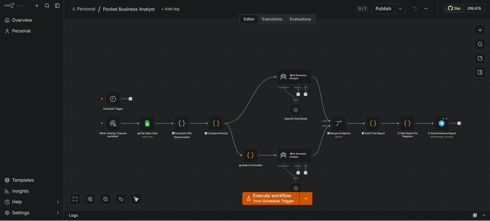
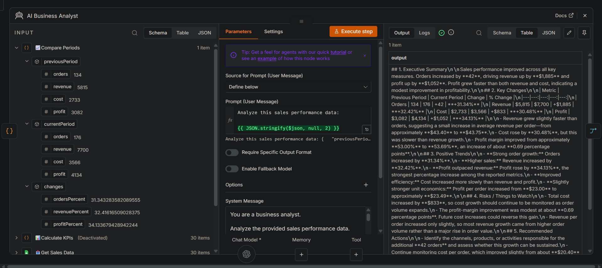
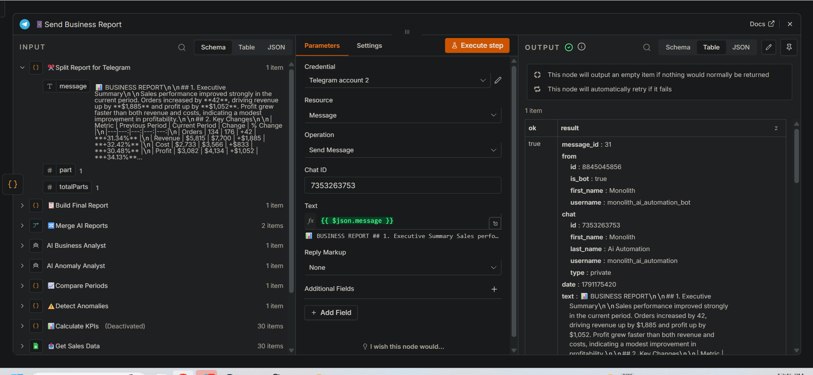

# Pocket Business Analyst

AI-powered sales intelligence automation built with n8n.

Pocket Business Analyst takes raw sales data, analyzes business performance, detects anomalies, and delivers a concise management report automatically via Telegram.

## What It Does

The system:

- collects sales data from Google Sheets
- calculates key business metrics
- compares previous and current periods
- analyzes sales performance using AI
- detects unusual or potentially risky trends
- generates AI-powered recommendations
- combines multiple analytical outputs into one report
- delivers the final report via Telegram
- automatically notifies the owner when the workflow fails

## Workflow

Google Sheets
↓
Sales Data Processing
↓
Period Comparison
↓
AI Business Analysis
↓
Anomaly Detection
↓
AI Anomaly Analysis
↓
Report Generation
↓
Telegram

## Key Features

### Sales Performance Analysis

The workflow compares sales periods and identifies changes in:

- Orders
- Revenue
- Costs
- Profit

### AI Business Analyst

An AI agent analyzes the calculated business data and produces:

- Executive Summary
- Key Changes
- Positive Trends
- Risks / Things to Watch
- Recommended Actions

### Anomaly Detection

The workflow checks the data for potentially important changes and sends detected anomalies to a separate AI analysis stage.

### Automated Reporting

The final business report is assembled automatically and delivered to Telegram.

### Error Handling

A dedicated Error Workflow catches failed executions and sends an automatic Telegram notification containing the workflow name and error message.

## Example

Example current-period results:

- Orders: 176
- Revenue: $7,700
- Cost: $3,566
- Profit: $4,134

The system compares these results with the previous period, identifies significant changes, analyzes potential risks, and generates actionable recommendations.

## Tech Stack

- n8n
- Google Sheets
- OpenAI
- Telegram
- JavaScript
- HTTP / API-based automation

## Business Value

This automation helps small businesses and teams turn raw sales data into actionable business intelligence without manually preparing recurring reports.

The system can be extended with:

- CRM data
- marketing data
- customer feedback
- inventory data
- competitor data
- scheduled reporting
- dashboards
- additional communication channels

## Project Architecture

The workflow consists of several independent stages:

1. Sales data collection
2. Data processing and period comparison
3. AI business analysis
4. Anomaly detection
5. AI anomaly analysis
6. Report aggregation
7. Telegram delivery
8. Automated error handling

This modular architecture makes the system easier to extend and adapt to different business processes.

## Screenshots

### Workflow Architecture

### AI Business Analysis

### Anomaly Analysis

### Automated Telegram Report

## Project Status

Working prototype / portfolio project.

Built as part of the MONOLITH AI automation portfolio.
